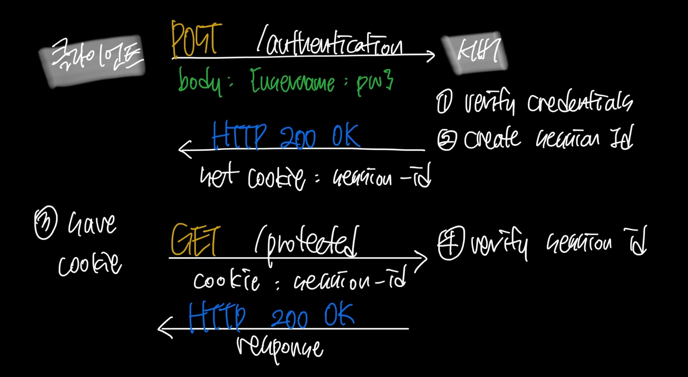
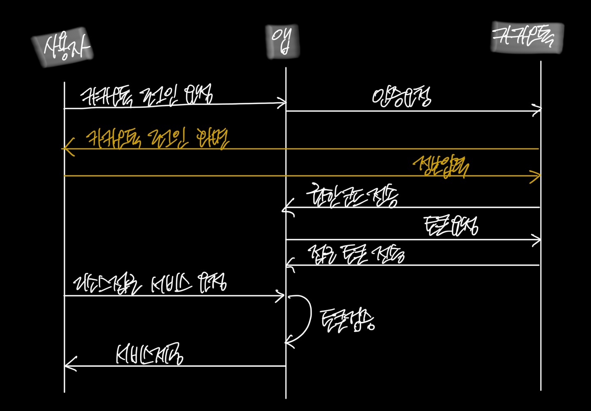
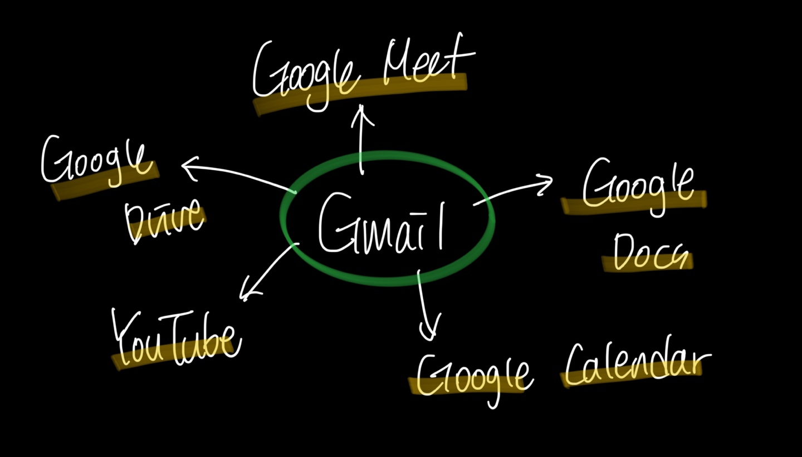

### 11-1. Authentication Strategies
* methods/techniques used to verify the identity of a user or system in order to grant access to a protected resource
* Several Authentication Strategies
	1. Basic Authentication 
	2. Session based Authentication
	3. Token based Authentication
	4. JWT Authentication
	5. OAuth
	6. SSO
### 11-2. Basic Authentication : 기본 인증
* Mechanism to authenticate access to resources over HTTP
* Credentials are sent in the request `Authorization` header
* Base64 encoded username and password
```jsx
Authorization: Basic <base64({username}:{password})> // base64로 인코딩된 문자열
```

### 11-3. Session based Authentication : 세션 기반 인증
* User is assigned soem unique identifier and this identifier is stored on the server in memory
* Client sends this **session id** in all the requests and server uses to identify the user
	
	1. 클라이언트가 로그인 > 세션 ID 발급 > 이후 쿠키로 인증 유지
	2. 세션은 서버 메모리나 Redis 같은 저장소에서 관리
	3. 클라이언트는 쿠키만 관리하고, 비밀번호를 매번 보내지 않아도 됨
	* 세션 ID
		* 사용자와 서버 간의 상호 작용을 위한 임시저장소로 서버가 관리하고 클라이언트는 ID만 보유
	* 쿠키
		* 브라우저에서 세션 ID를 저장하는 장소로 브라우저가 자동으로 관리 (자동 저장, 자동으로 포함)

### 11-4. Token Based Authentication : 토큰 기반 인증
* Unlike the basic auth where user name and password are sent in each request, in token based authentication, a token is sent from client to server in each request
* **Token**
	* some string generated by the server for client to send in each request
	1. some random looking string
	2. server doensn't store it (stateless)
	3. has an expiry after which token is not usuable
	4. normally sent in the authorization header
	5. normally signed with a secret so to identify any tampering and thus can be trusted by the server
	6. can be opaque or self-contained
		- opaque : doesn't contain any meaningful data
		- self-contained : token has the data and can be viewed by the clients (JWT) 
- example
	- SWT (simple web tokens)
	- JWT (JSON web tokens)
	- OAuth ( Open Authorization)
	- SAML
	- OpenID
### 11-5. 세션 기반 인증 vs 토큰 기반 인증
| 구분    | 세션 기반                         | 토큰 기반                         |
| ----- | ----------------------------- | ----------------------------- |
| 정보    | 각 요청마다 세션 Id를 기반으로 DB나 저장소 조회 | 토큰 자체가 정보를 모두 포함하고 있음, 추가조회 X |
| 서버 역할 | 사용자 정보가 서버 메모리에 저장            | 서버는 단순히 토큰의 유효성 검증            |

### 11-6. JWT (JSON Web Tokens)
* Form of token based authentication
* Based on an open standard (RFC 7519)
* can be used for authorization as well as secure info exchange
* just like any other token based auth strategy, only differenciator is how the token is generated
* Token is self-contained
* Token has 3 parts separated by a dot : XXXXXXX(header).YYYYYYY(payload).ZZZZZZZ(signature)
	* header : 사용된 암호화 알고리즘 저장, 토큰 타입 명시
	* payload : 사용자 정보, 클레임 포함
	* signature : 헤더와 페이로드 기반으로 생성, 서버의 비밀키로 서명
### 11-7. OAuth (Open Authorization) : 개방형인가 (=소셜로그인)
* open protocol for authorization that allows users to share their private resources to a third party


### 11-8. SSO (Single-Sign-On)
* Authentication strategy that allows a user to login with single username and password to several reload but independent services
* We get to login using Gmail and get access to the all Google products
*
* Without SSO, you will have to login to each service, using different credentials that you might have for each services

### 11-9. SAML (Security Assertion Markup Language)
* Open standard for exchanging authentication and authorization data between parties